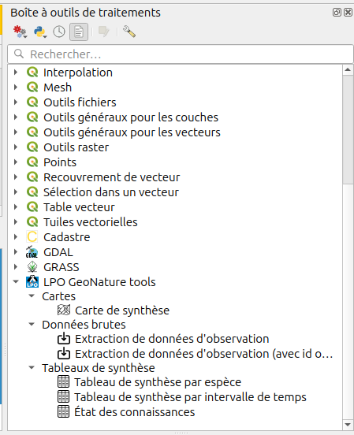

# Installation

## Configurations préalables

### Création de la connexion `PostGIS`

Dans QGIS, créez une nouvelle connexion PostGIS et nommez-la `geonature_lpo`, en choisissant les paramètres d'identification adaptés à votre situation.

### Enregistrement du fichier `startup.py`

Téléchargez le fichier [`startup.py`](https://raw.githubusercontent.com/lpoaura/PluginQGis-LPOData/master/config/startup.py) et placez le dans votre dossier de configuration de QGIS (**sans modifier son nom !**) à l'emplacement suivant de votre ordinateur : `C:\Users\<VotreNomUtilisateur>\AppData\Roaming\QGIS\QGIS3`

> :warning: Le dossier `<VotreNomUtilisateur>` correspond à **VOTRE propre** dossier utilisateur.

> :information_source: Le dossier `AppData` est un dossier **caché**, il est possible que vous ayez besoin de l'afficher manuellement !

## Installation du plugin

Ajouter le lien suivant à la liste des dépots d'extensions (Menu <kbd>Extension</kbd> > <kbd>Installer/Gérer les extensions...</kbd> puis sur le menu <kbd>Paramètres</kbd>):

<https://github.com/lpoaura/PluginQGis-LPOData/releases/latest/download/plugins.xml>

Rechargez ensuite les dépots et rendez-vous sur l'onglet <kbd>Toutes</kbd>, recherchez le plugin `LPO GeoNature tools` et installez le. Vous disposez maitenant d'une nouvelle liste de scripts votre **Boîte à outils de traitements** :




## Personnalisation

Le script d'extraction des données au format SINP est désactivable sur demande, à l'échelle de l'instance GeoNature. Cela se fait en ajoutant un paramètre dans la table gn_commons.t_parameters comme suit:

```sql
INSERT INTO gn_commons.t_parameters ( id_organism, parameter_name, parameter_desc, parameter_value
                                    , parameter_extra_value)
VALUES ( 0, 'plugin_qgis_lpo_exclude_export_sinp'
       , 'Option pour exclure le script d''export SINP du plugin QGIS LPO (valeurs possibles: "false","true")', 'true'
       , NULL);
```

Il est également nécessaire de personnaliser la liste des colonnes de statuts de protection/conservation des espèces souhaitées avec cette variable (à adapter selon le besoin). Ils correspondent à la liste des statuts de la vue matérialisée `taxonomie.mv_c_statut`:

```sql
INSERT INTO gn_commons.t_parameters ( 
       id_organism, 
       parameter_name, 
       parameter_desc, 
       parameter_value,
       parameter_extra_value
       )
VALUES (
       0, 
       'plugin_qgis_lpo_status_columns',
       'Liste des colonnes de statuts de protection/conservation à utilisées pour le plugin QGIS LPO',
       , '"{''lr_france'':''LR France'',''lr_r'': ''LR Régionale'',''n2k'':''Natura 2000'',''protection_nat'':''Protection nationale'',''conv_berne'':''Convention de Berne'',''conv_bonn'':''Convention de Bonn''}"'
       , NULL);
```